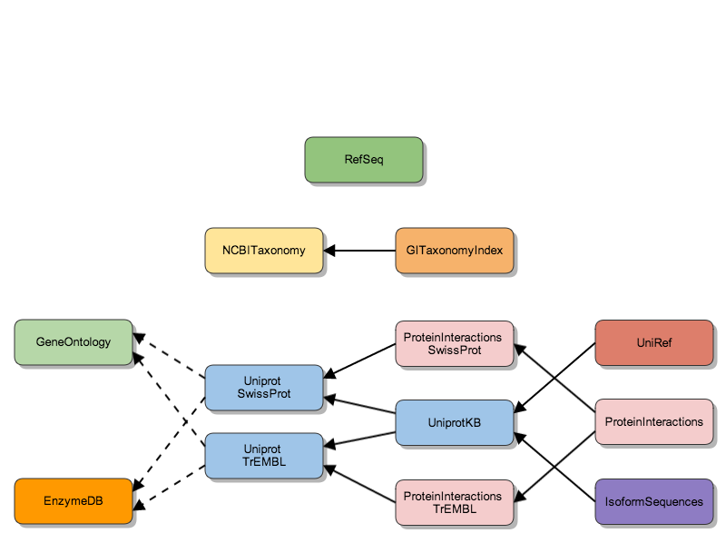
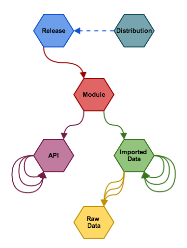

## Bio4j Modules

This is an abstract part of the [Statika](https://github.com/ohnosequences/statika)-based [Bio4j](https://github.com/bio4j/bio4j) module system. The idea is to represent the Bio4j modules (data imported from different sources) as Statika bundles. 

This will help us to manage dependencies between modules on the code level and make the module hierarchy really flexible and robust. 



On another level, every module has some inner structure which also can be represented with the help of Statika. 



See the [presentation](https://speakerdeck.com/ohnoseq/bio4j-plus-statika-managing-module-dependencies-on-the-type-level) about modularizing Bio4j with Statika (note that in it's [source](https://raw.github.com/bio4j/FOSDEM-2014/master/bio4j-plus-statika/bio4j-statika-slides.revealjs.md) you can find the "speaker notes", which may clarify something)


## Usage

### SBT dependency

To use it in you sbt-project, add this to you `build.sbt`:

```scala
resolvers += "Era7 maven releases" at "http://releases.era7.com.s3.amazonaws.com"

libraryDependencies += "bio4j" %% "modules" % "0.3.0"
```

### Usage in code

See the corresponding [doc](docs/usage.md) and also tests for the [NCBI Taxonomy module](https://github.com/bio4j/ncbi-taxonomy-module) for an example.


### Documentation

See documentation in `docs/` and autogenerated sources documentation in `docs/src/`.


## List of modules

Every module is an independent sbt-project in a separate repository:

- [NCBI Taxonomy](https://github.com/bio4j/ncbi-taxonomy-module)
- [GI Taxonomy Index](https://github.com/bio4j/gi-taxonomy-index-module)
- [RefSeq](https://github.com/bio4j/refseq-module) 
- [Gene Ontology](https://github.com/bio4j/gene-ontology-module) 

The code for the following modules is in the [`modules/`](modules/) directory and we work on separating them:

- [EnzymeDB](https://github.com/bio4j/enzymedb-module) 
- [UniprotKB](https://github.com/bio4j/uniprotkb-module) 
- [UniRef](https://github.com/bio4j/uniref-module) 
- [Protein Interactions](https://github.com/bio4j/protein-interactions-module) 
- [Isoform Sequences](https://github.com/bio4j/isoform-sequences-module) 
- [**Full Bio4j**](https://github.com/bio4j/full-bio4j-module) (aggregates all other modules)
