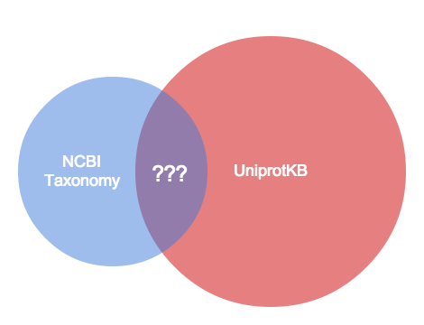

% Bio4j Modules
% Alexey Alekhin
% 04.02.2014

# Problem

----

### Current issues

- "Relationships/properties/nodes definition"  
  ([bio4j-titandb#8](https://github.com/bio4j/bio4j-titandb/issues/8))

> I suggest to separate this file [InitBio4jTitanDB] on the parts that correspond to Bio4j modules, so that particular properties/relations will be created only when they are needed. 

- "Split NodeRetriever interface" ([bio4j-model#5](https://github.com/bio4j/bio4j-model/issues/5))

> it would be good to have separate interface parts, to be able to restrict API usage depending on the modules that we have.

----

### Why we should split it

- This code is just _hard_ to maintain
- _Unrelated_ things shouldn't be mixed all together
- Modules should be really _autonomous_  
    + Every module should have it's own procedure of _initialization_,
      i.e of type definitions, that it needs for importing data
    + Every module should have it's own _restricted API_,
      which works only with those types

# Solution

----

### General structure

- Every module has some API
- Every module requires some type defs 

# Possible questions

----

### What is an "optional dependency"?

#### Common part? Mutual dependency?

----

### Just another module!

- Connector aggregates everything that exists **only** when you import **both** modules
- The other ones become really independent

----

### A strange release

What if we release such combination of modules?

It's fine! They are not connected, so 

- there is no any init/import conflict
- there is no connector's API
